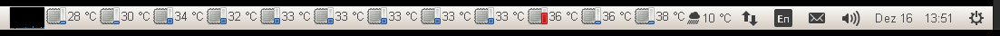
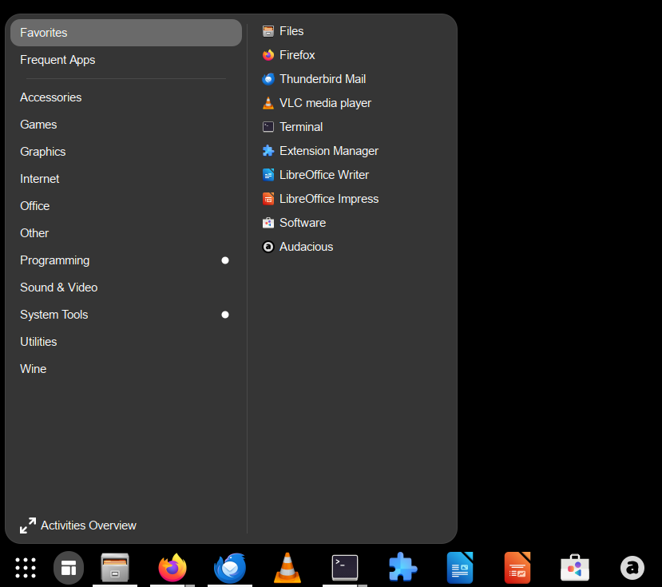
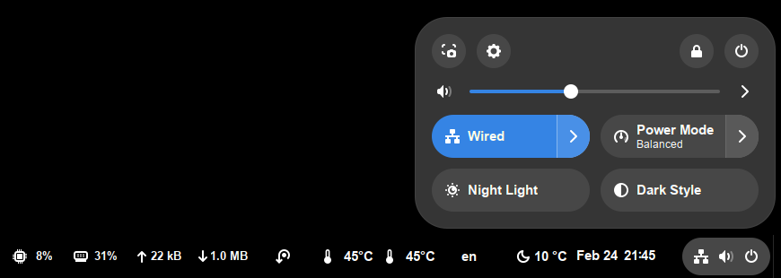

Ubuntu 24.04 gtk4 tweaks
========================
[Ubuntu 24.04.2 LTS (noble)](https://discourse.ubuntu.com/t/ubuntu-24-04-lts-noble-numbat-release-notes/39890)
uses [GNOME 46](https://release.gnome.org/46/) and GNOME 4 apps run on top of the [gtk4](https://docs.gtk.org/gtk4/) toolkit.

[GNOME](https://en.wikipedia.org/wiki/GNOME) supports different types of devices and screen resolutions.
In this scenario the target system is a PC with a single [GNOME Workspace](https://help.gnome.org/users/gnome-help/stable/shell-workspaces.html.en) on a
100dpi screen. The screen provides enough horizontal space to work with a
single taskbar which includes the active window list.

In the past the system used the [GNOME Flashback](https://en.wikipedia.org/wiki/GNOME#GNOME_Flashback) desktop environment
on GNOME 3, which provides a similar look & feel to the preceeding GNOME 2 version.
GNOME Flashback consists of the [Metacity Window Manager](https://wiki.gnome.org/Projects(2f)Metacity.html)
and the [GNOME Panel](https://wiki.gnome.org/Projects(2f)GnomePanel.html) taskbar.

GNOME Panel left                 | GNOME Panel right
---------------------------------|----------------------------------
 | 

Metacity is a gtk3 X11 window manager and will not support Wayland.
The Metacity Window Manager is still available for Ubuntu 24.04. But
to support modern apps and features the system was changed to use a
gtk4 environment with a similar user experience to GNOME Flashback.

Switch from GNOME Flashback to GNOME 4 Classic
----------------------------------------------
Different Ubuntu Desktop Environments can be selected from the login menu
after a logout from the current session.

The best choice on Ubuntu 24.04 is GNOME Classic on Xorg. Even if Wayland
is supposed to replace X11 in Linux, the GNOME Classic on Wayland session
has still too many issues.

- GNOME Panel has been replaced since GNOME 3 with [GNOME Shell](https://en.wikipedia.org/wiki/GNOME_Shell),
  which only works with the [Mutter window manager](https://en.wikipedia.org/wiki/Mutter_(software))

- Mutter is not compatible with old GNOME Panel addons, but it is highly
  configurable via [GNOME Extensions](https://extensions.gnome.org/).
  The extensions are installed and managed via the [Extension Manager](https://github.com/mjakeman/extension-manager).
  ```
  $ sudo apt install gnome-shell-extensions
  $ sudo apt install gnome-shell-extension-manager
  ```

The best solution for a single taskbar on a GNOME 4 desktop are the extensions:
- [Dash-to-Panel](https://extensions.gnome.org/extension/1160/dash-to-panel/)
- [ArcMenu](https://extensions.gnome.org/extension/3628/arcmenu/)
  ```
  -> Menu->Menu Layout: Traditional Gnome Menu
  -> Menu->Tweaks->Category Activation: Mouse Hover
  -> General->Position: Left
  ```
- the menu entries can be managed via the [Alacarte](https://en.wikipedia.org/wiki/Alacarte) menu editor.
  ```
  $ sudo apt install alacarte
  ```
- for CPU temperatures [Freon](https://extensions.gnome.org/extension/841/freon/)
  replaces the old [sensor-applet](https://help.ubuntu.com/community/SensorInstallHowto) for the GNOME Panel.
  ```
  $ sudo apt install lm-sensors
  ```
- to display the current weather next to the clock [Weather O'Clock](https://extensions.gnome.org/extension/5470/weather-oclock/)
  replaces the old [GNOME Panel](https://gitlab.gnome.org/GNOME/gnome-applets) gweather applet.
  ```
  $ sudo apt install gnome-weather
  ```

GNOME Dash-to-Panel+ArcMenu left              | GNOME Dash-to-Panel+ArcMenu right
----------------------------------------------|-----------------------------------------------
 | 

Allow window positioning for gtk4 startup applications
------------------------------------------------------
The gtk4 runtime does not support to set the window position anymore.
- gtk4 is modelled on Wayland, which (unlike X11) does not expose toplevel positions to clients.
- there is no longer a way to do this in gtk4, all window management is done through the window manager.
  the window manager positions top level windows by its own strategy (to avoid some security risks).
- the gtk_window_move() API from gtk3 does not work under Wayland, and it has been removed in gtk4.
  - [gtk_window_move](https://docs.gtk.org/gtk3/method.Window.move.html)
  - [Adapt to GdkWindow API changes](https://docs.gtk.org/gtk4/migrating-3to4.html#adapt-to-gdkwindow-api-changes)
  - [Adapt to GtkWindow API changes](https://docs.gtk.org/gtk4/migrating-3to4.html#adapt-to-gtkwindow-api-changes)
- this type of operation is only possible through manipulation via the GNOME Shell.
- the geometry option like `--geometry=100x50+10+10` of older X11 applications will ignore the X/Y-position.

The [Windows Calls](https://github.com/ickyicky/window-calls) extension provides access to the
Windows.Move API of the GNOME Shell, and can be called via [D-Bus](https://en.wikipedia.org/wiki/D-Bus) messages.
```
$ gdbus call --session --dest org.gnome.Shell --object-path /org/gnome/Shell/Extensions/Windows --method org.gnome.Shell.Extensions.Windows.List | python3 -c 'import sys; a=eval(sys.stdin.read()); pri
nt (a[0])' | jq '.[] | select(.wm_class_instance=="ghostty")'
  {
    "in_current_workspace": true,
    "wm_class": "com.mitchellh.ghostty",
    "wm_class_instance": "ghostty",
    "title": "~",
    "pid": 3873,
    "id": 3149279314,
    "frame_type": 0,
    "window_type": 0,
    "focus": false
  }
$ gdbus call --session --dest org.gnome.Shell --object-path /org/gnome/Shell/Extensions/Windows --method org.gnome.Shell.Extensions.Windows.Move 3149279314 10 10
```
It is very useful to have an option to set the position of startup windows.
Here is a simple [start_win_at](scripts/start_win_at) shell script, that takes the
window position, the application name and parameters as argument, and can be called
from the autostart folder.
```
$ start_win_at 10 10 ghostty --window-width=100 --window-height=50 --theme="Adwaita Dark"
```
The script works for any application opening a single Window and has to
1) wait for the Window Calls extension to be available on startup,
2) start the application,
3) find the window id as soon as the window is displayed, and
4) move the window to the requested position.

Note: There are extensions like [Another Window Session Manager](https://extensions.gnome.org/extension/4709/another-window-session-manager/)
that can restore window size and positions, but this is not the same like a clean startup configuration.

To run an application when a GNOME session starts, a script like [terminal1.desktop](autostart/terminal1.desktop)
has to be placed in the `.config/autostart` folder of the home directory. The command itself must be avaible in the shell `PATH`.

Note: It is also possible to manage startup-applications with the [gnome-tweaks](https://gitlab.gnome.org/GNOME/gnome-tweaks) tool.
But on GNOME 4 gnome-tweaks has some issues and sometimes overrides old entries.

Workaround for broken gtk3 window resize
----------------------------------------
Old GNOME 3 gtk3 apps are still supported in the GNOME 4 environment.
But in the Ubuntu 24.04 Xorg session the gtk3 windows are not resizable after
startup. This is a known issue and can be resolved by the command:
```
$ pkill -HUP mutter-x11-fram
```
see: [Mutter on X11 with Gnome 46, some windows no shadows, not resizable](https://gitlab.gnome.org/GNOME/mutter/-/issues/3417)

The script [fix_gtk3_win_resize](scripts/fix_gtk3_win_resize) waits for Mutter to be
available before the `SIGHUP` is send. To run this script when a GNOME session starts,
the autostart script [fix_gtk3_win_resize.desktop](autostart/fix_gtk3_win_resize.desktop)
has to be placed in the `.config/autostart` folder of the home directory.

